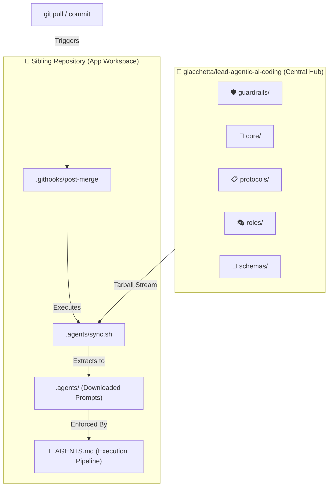

# 🤖 Lead Agentic AI Coding

> Centralized, agent-agnostic prompt hub & rule engine for modern AI coding assistants (*Claude Code, GitHub Copilot, OpenClaw, Hermes, etc.*).

---

## 📐 System Architecture



---

## 📂 Hub Structure

| Directory | Purpose | Primary Directives |
| :--- | :--- | :--- |
| 🛡️ **`guardrails/`** | **Non-Negotiables** | Prevent secret leaks, destructive CLI commands, and unauthorized `.env` edits. |
| 🎯 **`core/`** | **Quality Standards** | Enforce SOLID/DRY principles, strict typing, linting, and token efficiency. |
| 📋 **`protocols/`** | **Maintenance Rules** | Dictate *when* agents must update `AGENTS.md` and keep `README.md` visual. |
| 🎭 **`roles/`** | **Personas** | Behavioral prompts for System Architect and Code Reviewer tasks. |
| 📐 **`schemas/`** | **Structured Outputs** | JSON schemas for standardizing PR summaries and architecture logs. |

---

## ⚡ Connecting Sibling Repositories

### 1. One-Time Local Machine Setup
Tell Git to use tracked `.githooks/` folders globally across your machine:
```bash
git config --global core.hooksPath .githooks
```

### 2. Manual Prompt Sync
Inside any sibling repository, execute the sync script at any time to pull the latest rules from `main`:
```bash
./.agents/sync.sh
```

---

## 🛑 Execution Sequence for AI Agents

All AI agents operating in sibling workspaces **must** follow the rigid execution chain defined in their local `AGENTS.md`:

```text
1. GUARDRAILS CHECK  --> Read .agents/guardrails/*.md
2. CORE RULES        --> Read .agents/core/*.md
3. READ BLUEPRINT    --> Read Section 2 of local AGENTS.md (No recursive exploration)
4. EXECUTE TASK      --> Complete task following constraints
5. POST-CHECK        --> Update local AGENTS.md if system architecture changed
```